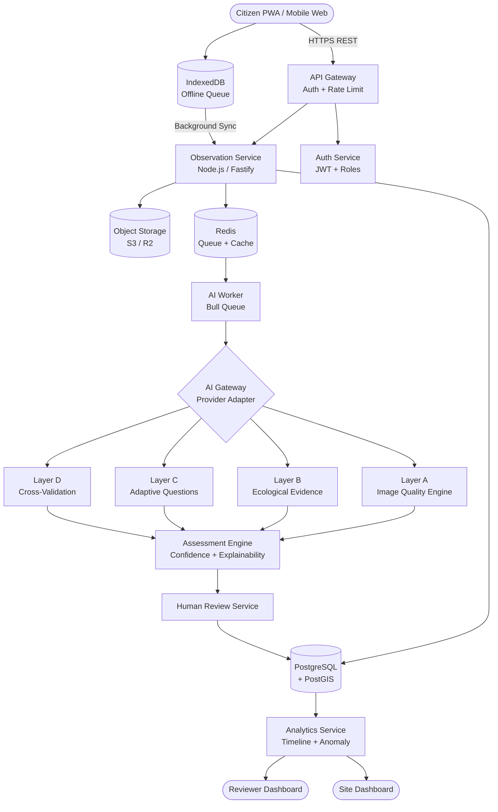
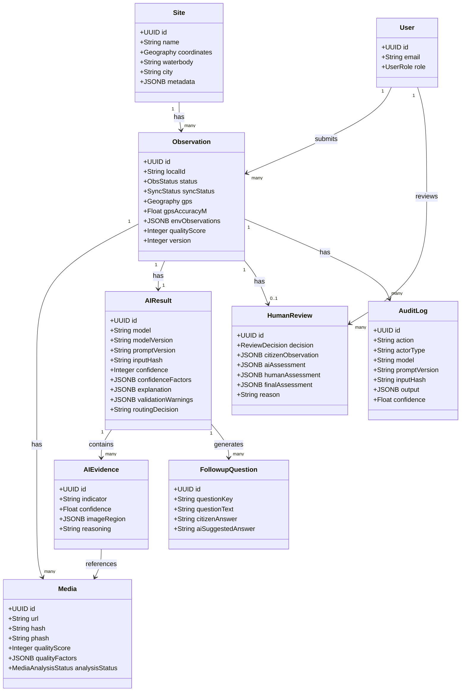

# AquaGuard AI — Step-by-Step Build Plan

> **OneAquaHealth IEEE Hackathon | Track 3: AI-Supported Assessment**
> Internal deadline: **September 30, 2026** | Devpost deadline: **October 4, 2026** | Start: September 28, 2026

> [!IMPORTANT]
> Build **P0 features production-shaped even if implementation is small**. Depth over breadth. Every AI output must have provenance. Never let AI silently overwrite citizen data.

---

## Section 1 — Full System Architecture



---

## Section 2 — Phase-by-Phase Build Steps

---

### Phase 0 — Foundation ⏱ Day 1 · ~4 hours

**Step 1 — Monorepo Setup**

```
aquaguard-ai/
├── apps/
│   ├── web/          # Next.js 14 PWA (Citizen + Reviewer UI)
│   ├── api/          # Fastify / Node.js REST API
│   └── worker/       # Bull queue worker (AI processing)
├── packages/
│   ├── shared/       # TypeScript types, Zod schemas, utils
│   └── ai-engine/    # AI layer implementations
├── package.json      # npm workspaces root
├── docker-compose.yml
└── .env.example
```

```bash
# root package.json workspaces
{
  "workspaces": ["apps/*", "packages/*"],
  "scripts": {
    "dev": "turbo run dev",
    "build": "turbo run build",
    "migrate": "npm run migrate -w apps/api",
    "seed": "npm run seed -w apps/api"
  }
}
```

---

**Step 2 — Full Database Schema (SQL DDL)**

```sql
-- Enable extensions
CREATE EXTENSION IF NOT EXISTS "uuid-ossp";
CREATE EXTENSION IF NOT EXISTS "postgis";

-- ─────────────────────────────────────────────
-- SITES
-- ─────────────────────────────────────────────
CREATE TABLE sites (
  id            UUID PRIMARY KEY DEFAULT uuid_generate_v4(),
  name          TEXT NOT NULL,
  description   TEXT,
  coordinates   GEOGRAPHY(POINT, 4326) NOT NULL,
  waterbody     TEXT,
  city          TEXT,
  country       TEXT,
  metadata      JSONB DEFAULT '{}',
  created_by    UUID,
  created_at    TIMESTAMPTZ DEFAULT NOW(),
  updated_at    TIMESTAMPTZ DEFAULT NOW()
);
CREATE INDEX idx_sites_coords ON sites USING GIST(coordinates);

-- ─────────────────────────────────────────────
-- USERS
-- ─────────────────────────────────────────────
CREATE TYPE user_role AS ENUM ('citizen', 'reviewer', 'admin');

CREATE TABLE users (
  id            UUID PRIMARY KEY DEFAULT uuid_generate_v4(),
  email         TEXT UNIQUE NOT NULL,
  password_hash TEXT NOT NULL,
  display_name  TEXT,
  role          user_role DEFAULT 'citizen',
  created_at    TIMESTAMPTZ DEFAULT NOW()
);

-- ─────────────────────────────────────────────
-- OBSERVATIONS
-- ─────────────────────────────────────────────
CREATE TYPE obs_status AS ENUM (
  'DRAFT', 'SUBMITTED', 'AI_CHECK',
  'VALID', 'REVIEW_REQUIRED', 'HUMAN_REVIEW',
  'ACCEPTED', 'CORRECTED', 'REJECTED', 'RESUBMIT_REQUESTED'
);
CREATE TYPE sync_status AS ENUM (
  'LOCAL', 'QUEUED', 'UPLOADING', 'PROCESSING', 'SYNCED', 'CONFLICT', 'FAILED'
);

CREATE TABLE observations (
  id                  UUID PRIMARY KEY DEFAULT uuid_generate_v4(),
  local_id            TEXT UNIQUE,                -- client-generated offline ID
  site_id             UUID REFERENCES sites(id),
  observer_id         UUID REFERENCES users(id),
  status              obs_status DEFAULT 'DRAFT',
  sync_status         sync_status DEFAULT 'LOCAL',
  gps                 GEOGRAPHY(POINT, 4326),
  gps_accuracy_m      FLOAT,
  observed_at         TIMESTAMPTZ NOT NULL,
  env_observations    JSONB DEFAULT '{}',         -- citizen structured answers
  quality_score       INTEGER,                    -- 0-100 overall
  version             INTEGER DEFAULT 1,
  created_at          TIMESTAMPTZ DEFAULT NOW(),
  updated_at          TIMESTAMPTZ DEFAULT NOW()
);
CREATE INDEX idx_obs_site ON observations(site_id);
CREATE INDEX idx_obs_status ON observations(status);
CREATE INDEX idx_obs_observer ON observations(observer_id);

-- ─────────────────────────────────────────────
-- OBSERVATION STATE TRANSITIONS (audit)
-- ─────────────────────────────────────────────
CREATE TABLE observation_state_transitions (
  id              UUID PRIMARY KEY DEFAULT uuid_generate_v4(),
  observation_id  UUID REFERENCES observations(id) ON DELETE CASCADE,
  from_state      obs_status,
  to_state        obs_status NOT NULL,
  triggered_by    TEXT,   -- 'system', 'ai', 'reviewer', 'citizen'
  actor_id        UUID,
  reason          TEXT,
  created_at      TIMESTAMPTZ DEFAULT NOW()
);

-- ─────────────────────────────────────────────
-- MEDIA
-- ─────────────────────────────────────────────
CREATE TYPE media_analysis_status AS ENUM (
  'PENDING', 'PROCESSING', 'COMPLETE', 'FAILED'
);

CREATE TABLE media (
  id                UUID PRIMARY KEY DEFAULT uuid_generate_v4(),
  observation_id    UUID REFERENCES observations(id) ON DELETE CASCADE,
  url               TEXT NOT NULL,
  original_url      TEXT,                     -- keep original separate from compressed
  hash              TEXT NOT NULL,            -- SHA-256 for dedup
  phash             TEXT,                     -- perceptual hash for visual dedup
  mime_type         TEXT NOT NULL,
  file_size_bytes   BIGINT,
  capture_timestamp TIMESTAMPTZ,
  gps               GEOGRAPHY(POINT, 4326),
  quality_score     INTEGER,
  quality_factors   JSONB DEFAULT '{}',       -- blur, brightness, occlusion breakdown
  analysis_status   media_analysis_status DEFAULT 'PENDING',
  created_at        TIMESTAMPTZ DEFAULT NOW()
);
CREATE INDEX idx_media_obs ON media(observation_id);
CREATE INDEX idx_media_hash ON media(hash);

-- ─────────────────────────────────────────────
-- AI RESULTS
-- ─────────────────────────────────────────────
CREATE TABLE ai_results (
  id                  UUID PRIMARY KEY DEFAULT uuid_generate_v4(),
  observation_id      UUID REFERENCES observations(id) ON DELETE CASCADE,
  model               TEXT NOT NULL,
  model_version       TEXT NOT NULL,
  prompt_version      TEXT NOT NULL,
  input_hash          TEXT,               -- hash of inputs sent to model
  confidence          INTEGER,           -- 0-100
  confidence_factors  JSONB DEFAULT '{}', -- per-factor breakdown
  explanation         JSONB DEFAULT '{}', -- WHAT/WHY/EVIDENCE/NEXT_ACTION
  validation_warnings JSONB DEFAULT '[]',
  routing_decision    TEXT,              -- VALID / REVIEW_REQUIRED / HUMAN_REVIEW
  created_at          TIMESTAMPTZ DEFAULT NOW()
);

-- ─────────────────────────────────────────────
-- AI EVIDENCE (per-indicator detections)
-- ─────────────────────────────────────────────
CREATE TABLE ai_evidence (
  id              UUID PRIMARY KEY DEFAULT uuid_generate_v4(),
  ai_result_id    UUID REFERENCES ai_results(id) ON DELETE CASCADE,
  indicator       TEXT NOT NULL,         -- e.g. 'turbidity', 'floating_debris'
  confidence      FLOAT NOT NULL,        -- 0.0 to 1.0
  source_media_id UUID REFERENCES media(id),
  image_region    JSONB,                 -- {x, y, w, h} normalised 0-1
  model           TEXT,
  model_version   TEXT,
  created_at      TIMESTAMPTZ DEFAULT NOW()
);

-- ─────────────────────────────────────────────
-- FOLLOW-UP QUESTIONS (adaptive)
-- ─────────────────────────────────────────────
CREATE TABLE followup_questions (
  id                  UUID PRIMARY KEY DEFAULT uuid_generate_v4(),
  ai_result_id        UUID REFERENCES ai_results(id) ON DELETE CASCADE,
  question_key        TEXT NOT NULL,      -- e.g. 'water_clarity_depth'
  question_text       TEXT NOT NULL,
  indicator_type      TEXT,
  display_order       INTEGER,
  citizen_answer      TEXT,
  ai_suggested_answer TEXT,
  answered_at         TIMESTAMPTZ,
  created_at          TIMESTAMPTZ DEFAULT NOW()
);

-- ─────────────────────────────────────────────
-- HUMAN REVIEWS
-- ─────────────────────────────────────────────
CREATE TYPE review_decision AS ENUM (
  'ACCEPTED', 'CORRECTED', 'REJECTED', 'RESUBMIT_REQUESTED'
);

CREATE TABLE human_reviews (
  id                   UUID PRIMARY KEY DEFAULT uuid_generate_v4(),
  observation_id       UUID REFERENCES observations(id) ON DELETE CASCADE,
  reviewer_id          UUID REFERENCES users(id),
  decision             review_decision NOT NULL,
  citizen_observation  JSONB,     -- snapshot of citizen answers at review time
  ai_assessment        JSONB,     -- snapshot of AI result at review time
  human_assessment     JSONB,     -- reviewer's corrections
  final_assessment     JSONB,     -- merged final record
  reason               TEXT,
  created_at           TIMESTAMPTZ DEFAULT NOW()
);

-- ─────────────────────────────────────────────
-- AUDIT LOGS (full provenance)
-- ─────────────────────────────────────────────
CREATE TABLE audit_logs (
  id               UUID PRIMARY KEY DEFAULT uuid_generate_v4(),
  observation_id   UUID REFERENCES observations(id),
  action           TEXT NOT NULL,    -- 'ai_quality_check', 'ai_analyze', 'human_accept', etc.
  actor_type       TEXT NOT NULL,    -- 'ai', 'citizen', 'reviewer', 'system'
  actor_id         UUID,
  model            TEXT,
  model_version    TEXT,
  prompt_version   TEXT,
  input_hash       TEXT,
  output           JSONB,
  confidence       FLOAT,
  human_decision   TEXT,
  correction_reason TEXT,
  created_at       TIMESTAMPTZ DEFAULT NOW()
);
CREATE INDEX idx_audit_obs ON audit_logs(observation_id);
```

---

**Step 3 — Docker Compose**

```yaml
# docker-compose.yml
version: "3.9"
services:
  db:
    image: postgis/postgis:15-3.3
    environment:
      POSTGRES_DB: aquaguard
      POSTGRES_USER: aquaguard
      POSTGRES_PASSWORD: ${DB_PASSWORD}
    ports: ["5432:5432"]
    volumes: [pg_data:/var/lib/postgresql/data]
    healthcheck:
      test: ["CMD-SHELL", "pg_isready -U aquaguard"]
      interval: 5s
      retries: 5

  redis:
    image: redis:7-alpine
    ports: ["6379:6379"]
    healthcheck:
      test: ["CMD", "redis-cli", "ping"]

  api:
    build: ./apps/api
    ports: ["3001:3001"]
    environment:
      DATABASE_URL: postgresql://aquaguard:${DB_PASSWORD}@db:5432/aquaguard
      REDIS_URL: redis://redis:6379
    depends_on:
      db: { condition: service_healthy }
      redis: { condition: service_healthy }

  worker:
    build: ./apps/worker
    environment:
      DATABASE_URL: postgresql://aquaguard:${DB_PASSWORD}@db:5432/aquaguard
      REDIS_URL: redis://redis:6379
      GEMINI_API_KEY: ${GEMINI_API_KEY}
      OPENAI_API_KEY: ${OPENAI_API_KEY}
    depends_on: [db, redis]

  web:
    build: ./apps/web
    ports: ["3000:3000"]
    environment:
      NEXT_PUBLIC_API_URL: http://localhost:3001

volumes:
  pg_data:
```

---

**Step 4 — Auth Scaffold**

```typescript
// packages/shared/src/types/auth.ts
export type UserRole = 'citizen' | 'reviewer' | 'admin';

export interface JWTPayload {
  sub: string;      // user id
  email: string;
  role: UserRole;
  iat: number;
  exp: number;
}

// Middleware: requireRole('reviewer')
export function requireRole(...roles: UserRole[]) {
  return (req, reply, done) => {
    if (!roles.includes(req.user.role)) {
      return reply.status(403).send({ error: 'Insufficient permissions' });
    }
    done();
  };
}
```

---

### Phase 1 — Core Observation Flow ⏱ Days 1–2 · ~8 hours

**Step 5 — Site CRUD API**
```
POST   /sites              → create site (reviewer/admin)
GET    /sites              → list with ?bbox=lng1,lat1,lng2,lat2
GET    /sites/:id          → get site with last 5 observations summary
PATCH  /sites/:id          → update metadata
```

**Step 6 — Observation API (with Zod validation)**
```typescript
// packages/shared/src/schemas/observation.ts
export const CreateObservationSchema = z.object({
  siteId:      z.string().uuid(),
  localId:     z.string().optional(),
  gps:         z.object({ lat: z.number(), lng: z.number(), accuracy: z.number() }),
  observedAt:  z.string().datetime(),
  envObservations: z.record(z.string(), z.unknown()).optional(),
});

// POST /observations → returns { id, localId, status: 'DRAFT' }
// GET  /observations/:id
// PATCH /observations/:id  (citizen can edit while DRAFT)
```

**Step 7 — Media Upload Pipeline**
```
Client                        API                    Storage
  │                            │                        │
  ├─ compress image (canvas) ──┤                        │
  ├─ SHA-256 checksum ─────────┤                        │
  ├─ POST /observations/:id/media/presign ─────────────►│
  │                            ├─ check hash for dedup  │
  │◄─── presigned S3 URL ──────┤                        │
  ├─ PUT direct to S3 ─────────────────────────────────►│
  ├─ POST /observations/:id/media/confirm ─────────────►│
  │                            ├─ enqueue quality job   │
  │◄─── { mediaId, status } ───┤                        │
```

**Step 8 — Observation State Machine**
```typescript
// apps/api/src/services/stateMachine.ts
const TRANSITIONS: Record<ObsStatus, ObsStatus[]> = {
  DRAFT:              ['SUBMITTED'],
  SUBMITTED:          ['AI_CHECK'],
  AI_CHECK:           ['VALID', 'REVIEW_REQUIRED', 'HUMAN_REVIEW'],
  VALID:              ['ACCEPTED'],
  REVIEW_REQUIRED:    ['HUMAN_REVIEW', 'VALID'],
  HUMAN_REVIEW:       ['ACCEPTED', 'CORRECTED', 'REJECTED', 'RESUBMIT_REQUESTED'],
  ACCEPTED:           [],
  CORRECTED:          [],
  REJECTED:           [],
  RESUBMIT_REQUESTED: ['SUBMITTED'],
};

async function transition(obsId: string, to: ObsStatus, actor: Actor) {
  const obs = await db.observations.findById(obsId);
  if (!TRANSITIONS[obs.status].includes(to)) throw new Error('Invalid transition');
  await db.observations.update(obsId, { status: to });
  await db.stateTransitions.insert({ observationId: obsId, fromState: obs.status, toState: to, ...actor });
  await db.auditLogs.insert({ observationId: obsId, action: `state_${to}`, ...actor });
}
```

**Step 9 — Citizen Multi-Step Form (Next.js)**
```
Step 1: Site Selection    → MapPicker or search + recent sites list
Step 2: Evidence Capture  → Camera/file upload, GPS auto-captured
Step 3: Observations      → Structured form (flow, colour, odour, vegetation)
Step 4: AI Guidance       → Show quality check results + follow-up questions
Step 5: Review + Submit   → Summary card, confidence preview, submit button
```

**Step 10 — GPS + Timestamp Auto-Capture**
```typescript
navigator.geolocation.getCurrentPosition(
  (pos) => setGps({ lat: pos.coords.latitude, lng: pos.coords.longitude, accuracy: pos.coords.accuracy }),
  (err) => setGpsError('Location unavailable — please enter manually'),
  { enableHighAccuracy: true, timeout: 10000 }
);
```

**Step 11 — Offline Queue**
```typescript
// syncStatus state machine
// LOCAL → QUEUED → UPLOADING → PROCESSING → SYNCED | FAILED | CONFLICT

interface OfflineObservation {
  localId: string;
  serverId?: string;
  syncStatus: SyncStatus;
  data: CreateObservationInput;
  createdAt: string;
  retryCount: number;
}

// On network restore:
window.addEventListener('online', () => syncEngine.flush());
// Service Worker Background Sync fallback:
self.addEventListener('sync', (e) => { if (e.tag === 'sync-observations') e.waitUntil(syncAll()); });
```

---

### Phase 2 — AI Layer A: Image Quality Engine ⏱ Day 2 · ~5 hours

**Step 12 — Quality Analysis Service**

| Check | Method | Threshold | Score Weight |
|---|---|---|---|
| Blur detection | Laplacian variance on grayscale | variance < 100 → blurry | 30% |
| Brightness | Pixel histogram mean | mean < 50 (dark) or > 210 (blown) | 20% |
| Occlusion | Edge density in centre 50% region | < 0.05 → occluded | 20% |
| Stream relevance | Vision model prompt | Yes/No/Uncertain | 30% |

**Step 13 — AI Gateway Adapter (provider-agnostic)**
```typescript
// packages/ai-engine/src/gateway.ts
interface VisionRequest { images: Buffer[]; prompt: string; maxTokens?: number; }
interface VisionResponse { text: string; usage: TokenUsage; model: string; }

class AIGateway {
  async vision(req: VisionRequest): Promise<VisionResponse> {
    if (this.provider === 'gemini') return this.geminiVision(req);
    if (this.provider === 'openai') return this.openaiVision(req);
    throw new Error(`Unknown provider: ${this.provider}`);
  }
}
```

**Step 14 — Duplicate Detection (pHash)**
```typescript
import { imageHash } from 'image-hash';
// Hamming distance < 10 between phash strings → likely duplicate
function isDuplicate(hash1: string, hash2: string): boolean {
  return hammingDistance(hash1, hash2) < 10;
}
```

**Step 15 — Quality Score Formula**
```
quality_score = (blur_score × 0.30) + (brightness_score × 0.20)
              + (occlusion_score × 0.20) + (relevance_score × 0.30)

Each sub-score: 0–100
```

**Step 16 — Quality Check API**
```
POST /observations/:id/media/:mediaId/quality-check
→ {
    score: 42,
    grade: "poor" | "fair" | "good",
    factors: [
      { name: "blur", score: 30, message: "Image is slightly out of focus" },
      { name: "brightness", score: 80, message: "Good exposure" },
      { name: "occlusion", score: 20, message: "Large foreground obstruction detected" },
      { name: "stream_relevance", score: 90, message: "Water body clearly visible" }
    ],
    suggestions: ["Retake from 2m further back to remove foreground object"],
    approved: false
  }
```

**Step 17 — Quality Feedback UI**
```
📷 Image Quality: 42/100  🟡 Fair
─────────────────────────────────
✅ Water body visible
✅ Good brightness
⚠️  Slightly out of focus
❌ Large foreground obstruction

💡 Suggestion: Step back ~2m and retake to remove the obstruction.
[ Use anyway ] [ Retake photo ]
```

---

### Phase 3 — AI Layer B: Ecological Evidence Detection ⏱ Days 2–3 · ~6 hours

**Step 18 — Evidence Detection Prompt (chain-of-thought)**

```
You are an ecological field assessment assistant. 
Analyse the attached stream photograph scientifically.

For each indicator below, state:
- present: true/false/uncertain
- confidence: 0.0–1.0
- reasoning: one sentence
- image_region: approximate {x,y,w,h} as fractions 0–1, or null

Indicators to assess:
1. turbidity (water appears cloudy/murky)
2. floating_debris (visible litter, leaves, foam)
3. algae_bloom (green/blue-green surface coverage)
4. vegetation_presence (bankside or in-channel plants)
5. concrete_channel (artificial channelisation)
6. natural_channel (natural banks/substrate)
7. foam_presence (persistent white foam)
8. water_color_anomaly (brown, orange, grey — not natural clear)
9. low_water_flow (stagnant or very slow)
10. high_water_flow (fast, turbulent)

Respond ONLY in valid JSON matching the schema provided.
Do NOT make definitive pollution conclusions.
State only what is visually observable.
```

**Step 19 — Evidence JSON Schema**
```typescript
interface AIEvidence {
  indicator: string;
  present: boolean | 'uncertain';
  confidence: number;        // 0.0–1.0
  reasoning: string;
  sourceMeidaId: string;
  imageRegion: { x: number; y: number; w: number; h: number } | null;
  model: string;
  modelVersion: string;
  timestamp: string;
}
```

**Step 20 — Database Storage** → insert into `ai_evidence` table per detected indicator.

**Step 21 — Analysis API**
```
POST /observations/:id/analyze         → enqueue job, return { jobId }
GET  /observations/:id/analysis-status → { status, jobId, result? }
GET  /observations/:id/evidence        → list of ai_evidence rows
```

**Step 22 — Evidence Display Cards**
```
┌─ Detected Indicators ──────────────────────────────┐
│  🟠 Turbidity          ██████████░░  87% confidence  │
│     "Water appears cloudy with reduced clarity"       │
│                                                       │
│  🔴 Floating Debris    ████████░░░░  72% confidence  │
│     "Scattered material visible on surface"           │
│                                                       │
│  🟢 Vegetation Present ████████████  94% confidence  │
│     "Bankside vegetation clearly visible"             │
└───────────────────────────────────────────────────────┘
```

---

### Phase 4 — AI Layer C: Adaptive Follow-up Questions ⏱ Day 3 · ~4 hours

**Step 23 — Question Bank (25 questions, tagged by indicator)**

| Key | Question | Trigger Indicator |
|---|---|---|
| `water_clarity_depth` | Can you see the streambed through the water? | turbidity |
| `water_clarity_level` | How would you describe the water: clear, slightly cloudy, or very cloudy? | turbidity |
| `debris_source` | Is the debris floating continuously or only in one small area? | floating_debris |
| `debris_type` | What type of material is floating? (leaves/litter/foam/other) | floating_debris |
| `algae_coverage` | What percentage of the water surface appears covered? | algae_bloom |
| `odour` | Can you detect any unusual smell? (none/earthy/chemical/sewage) | any |
| `flow_estimate` | How fast does the water appear to be flowing? | low_water_flow / high_water_flow |
| `channel_type` | Is the streambed natural rock/gravel or concrete/artificial? | concrete_channel |
| `vegetation_type` | Is the bankside vegetation healthy or appears stressed/dying? | vegetation_presence |
| `foam_persistence` | Has the foam been present throughout your visit? | foam_presence |

**Step 24 — Selection Engine**
```typescript
function selectQuestions(evidence: AIEvidence[], maxQuestions = 5): Question[] {
  const triggered = evidence
    .filter(e => e.present === true && e.confidence > 0.6)
    .sort((a, b) => b.confidence - a.confidence);
  
  const selected: Question[] = [];
  for (const e of triggered) {
    const qs = QUESTION_BANK.filter(q => q.indicatorType === e.indicator);
    for (const q of qs) {
      if (!selected.find(s => s.key === q.key)) selected.push(q);
      if (selected.length >= maxQuestions) break;
    }
    if (selected.length >= maxQuestions) break;
  }
  return selected;
}
```

**Step 25 — Adaptive Question UI**
```
┌──────────────────────────────────────────────────────┐
│  Question 2 of 4                                      │
│                                                       │
│  Based on the image, the water appears cloudy.        │
│                                                       │
│  ❓ Can you see the streambed through the water?       │
│                                                       │
│    ○ Yes, clearly                                     │
│    ○ Partially                                        │
│    ● No, water is too cloudy                          │
│                                                       │
│                          [← Back]  [Next Question →] │
└──────────────────────────────────────────────────────┘
```

**Step 26 — Answer Storage** → `followup_questions.citizen_answer` updated on each response.

**Step 27 — API**
```
GET  /observations/:id/followup-questions   → ordered list
POST /observations/:id/followup-questions/:key/answer  → { answer: string }
```

---

### Phase 5 — AI Layer D: Cross-Validation Engine ⏱ Day 3 · ~5 hours

**Step 28 — Deterministic Rule Engine**
```typescript
const RULES: ValidationRule[] = [
  {
    id: 'turbidity_clarity_conflict',
    check: (citizen, ai) =>
      citizen.envObservations.waterClarity === 'clear' &&
      ai.evidence.find(e => e.indicator === 'turbidity')?.confidence > 0.70,
    warning: { type: 'CITIZEN_AI_CONFLICT', severity: 'HIGH',
      message: 'Your "clear water" answer may not match the image analysis.' }
  },
  {
    id: 'debris_conflict',
    check: (citizen, ai) =>
      citizen.envObservations.debris === 'none' &&
      ai.evidence.find(e => e.indicator === 'floating_debris')?.confidence > 0.80,
    warning: { type: 'CITIZEN_AI_CONFLICT', severity: 'HIGH',
      message: 'No debris was selected but the image suggests debris may be present.' }
  },
  {
    id: 'low_gps_accuracy',
    check: (citizen) => citizen.gps.accuracy > 50,
    warning: { type: 'DATA_QUALITY', severity: 'MEDIUM',
      message: 'GPS accuracy is low (>50m). Location may be imprecise.' }
  },
  {
    id: 'poor_image_quality',
    check: (_, __, media) => media.qualityScore < 40,
    warning: { type: 'DATA_QUALITY', severity: 'HIGH',
      message: 'Image quality is insufficient for reliable analysis.' }
  },
];
```

**Step 29 — Historical Comparison**
```sql
-- Baseline: average of last 10 ACCEPTED/CORRECTED observations at same site
SELECT
  AVG((env_observations->>'waterClarityScore')::float) AS avg_clarity,
  STDDEV((env_observations->>'waterClarityScore')::float) AS std_clarity
FROM observations
WHERE site_id = $1
  AND status IN ('ACCEPTED', 'CORRECTED')
ORDER BY observed_at DESC
LIMIT 10;
```

**Step 30 — LLM Conflict Explanation**
```typescript
// For each conflict, generate a structured explanation
async function explainConflict(conflict: ValidationWarning): Promise<Explanation> {
  const prompt = `A citizen observation has a potential inconsistency.
Citizen answered: "${conflict.citizenAnswer}"
AI detected: "${conflict.aiDetection}" with ${conflict.confidence * 100}% confidence.

Generate a brief, non-alarmist explanation with:
- WHAT: what was detected
- WHY: why this might be an inconsistency  
- NEXT_ACTION: a simple, helpful action for the citizen

Respond in JSON: { what, why, nextAction }`;
  return await aiGateway.json(prompt);
}
```

**Step 31 — Validation Warning Schema**
```typescript
interface ValidationWarning {
  type: 'CITIZEN_AI_CONFLICT' | 'DATA_QUALITY' | 'HISTORICAL_ANOMALY' | 'GPS_ISSUE';
  severity: 'LOW' | 'MEDIUM' | 'HIGH';
  citizenAnswer?: string;
  aiDetection?: string;
  confidence?: number;
  explanation: { what: string; why: string; nextAction: string };
  resolved: boolean;
}
```

**Step 32 — Conflict Resolution UI**
```
⚠️  Possible inconsistency detected

WHAT: The image shows possible water turbidity.
WHY:  You selected "clear water" but the analysis detected
      reduced water clarity with 81% confidence.

ACTION: Please review your water clarity response.

  [ Keep my answer ]  [ Update my answer ]  [ Add a note ]
```

**Step 33 — Validation API**
```
POST /observations/:id/validate
→ { warnings: ValidationWarning[], overallValid: boolean, requiresReview: boolean }
```

---

### Phase 6 — Confidence & Explainability Engine ⏱ Days 3–4 · ~4 hours

**Step 34 — Confidence Algorithm**
```typescript
function calculateConfidence(input: ConfidenceInput): ConfidenceResult {
  const imageQuality       = input.mediaQualityScore ?? 0;
  const aiEvidenceAgreement = calcEvidenceAgreement(input.evidence);
  const citizenConsistency  = 100 - (input.validationWarnings.filter(w => !w.resolved).length * 15);
  const gpsValidity         = input.gpsAccuracyM < 20 ? 100 : input.gpsAccuracyM < 50 ? 70 : 30;
  const historicalConsistency = input.historicalZScore < 2 ? 100 : input.historicalZScore < 3 ? 60 : 20;

  const score = Math.round(
    imageQuality        * 0.25 +
    aiEvidenceAgreement * 0.30 +
    Math.max(0, citizenConsistency) * 0.25 +
    gpsValidity         * 0.10 +
    historicalConsistency * 0.10
  );

  const routing =
    score >= 80 ? 'VALID' :
    score >= 60 ? 'REVIEW_REQUIRED' :
    'HUMAN_REVIEW';

  return { score, factors: { imageQuality, aiEvidenceAgreement, citizenConsistency, gpsValidity, historicalConsistency }, routing };
}
```

**Step 35 — Explainability Template**
```typescript
interface ExplainedAssessment {
  what: string;       // "Possible turbidity detected"
  why: string;        // "Reduced streambed visibility and brown pixel distribution suggest turbidity"
  evidence: string[]; // ["Photo #2 — AI detected turbidity (87% confidence)"]
  confidence: number;
  nextAction: string; // "Reviewer recommended due to historical inconsistency"
  factors: ConfidenceFactors;
}
```

**Step 36 — Confidence Display Component**
```
Assessment Reliability: 74 / 100  🟡 Moderate
━━━━━━━━━━━━━━━━━━━━━━━━━━━━━━━━━━━━━━━━━━━━
Factor                    Score   Weight
Image Quality              88      25%
AI Evidence Agreement      72      30%
Citizen Consistency        65      25%
GPS Validity              100      10%
Historical Consistency     58      10%
━━━━━━━━━━━━━━━━━━━━━━━━━━━━━━━━━━━━━━━━━━━━
⚠️ Why isn't confidence higher?
Previous observations at this site reported clear water,
while this observation indicates possible turbidity.
A reviewer is recommended.

Status: → REVIEW REQUIRED
```

**Step 37 — Confidence-Based Routing**
```
Score ≥ 80  →  VALID (auto-accepted, no reviewer needed)
Score 60–79 →  REVIEW_REQUIRED (enters review queue)
Score < 60  →  HUMAN_REVIEW (mandatory expert review)
```

---

### Phase 7 — Human Review System ⏱ Day 4 · ~6 hours

**Step 38 — Review Queue API**
```
GET /review/queue?minConfidence=0&maxConfidence=79&site=uuid&page=1&limit=20
→ { total, items: [{ observationId, site, confidence, qualityScore, warnings, submittedAt }] }
```

**Step 39 — Reviewer Detail View (layout)**
```
┌─── Left Panel ─────────────────┬──── Right Panel ──────────────────────┐
│ 📷 Photos (gallery)            │ 🏷  Observation #1024                  │
│                                │ Site: Merri Creek — Clifton Hill       │
│ [highlight image region on     │ Submitted: 28 Sep 2026, 08:14          │
│  click from evidence panel]    │ Confidence: 61/100 ⚠️                  │
│                                │                                        │
├─── AI Evidence ────────────────│─── Citizen Answers ─────────────────── │
│ 🟠 Turbidity        87%        │ Water clarity: Clear                   │
│ 🔴 Floating debris  72%        │ Odour: None                            │
│ 🟢 Vegetation       94%        │ Debris: None                           │
│                                │                                        │
├─── Warnings ───────────────────│─── Historical (last 5 obs) ─────────── │
│ ⚠️ Citizen answer conflicts    │ Aug 14  🟢 Clear                       │
│    image evidence              │ Aug 28  🟢 Clear                       │
│ ⚠️ Deviation from site history │ Sep 07  🟡 Slightly cloudy             │
│                                │ Sep 15  🟢 Clear                       │
│                                │ Sep 28  🔴 ← THIS                     │
├────────────────────────────────┴───────────────────────────────────────┤
│  [✅ Accept]  [✏️ Correct]  [❌ Reject]  [🔄 Request Resubmission]       │
└─────────────────────────────────────────────────────────────────────────┘
```

**Step 40 — Review Actions API**
```
POST /assessments/:id/review
Body: {
  decision: "ACCEPTED" | "CORRECTED" | "REJECTED" | "RESUBMIT_REQUESTED",
  corrections?: { waterClarity: "slightly_turbid", debris: "present" },
  reason: "Image clearly shows turbidity despite citizen reporting clear"
}
→ triggers state machine transition + audit log
```

**Step 41 — Separate Data Columns (never overwrite)**
```
citizen_observation  = { waterClarity: "clear", debris: "none" }
ai_assessment        = { turbidity: 0.87, floating_debris: 0.72 }
human_assessment     = { waterClarity: "slightly_turbid", debris: "present" }
final_assessment     = human_assessment (when corrected) or citizen_observation (when accepted)
correction_reason    = "Image clearly shows turbidity..."
```

**Step 42 — Audit Trail** → Every action (AI call, state change, human decision) written to `audit_logs` with full provenance.

**Step 43 — Reviewer Dashboard**
```
Stats Cards:
┌──────────────┐ ┌──────────────┐ ┌──────────────┐ ┌──────────────┐
│  Pending     │ │  Accepted    │ │  Rejected    │ │  Anomalies   │
│    14        │ │    87        │ │     6        │ │     3        │
│  review      │ │  today       │ │  this week   │ │  sites       │
└──────────────┘ └──────────────┘ └──────────────┘ └──────────────┘
```

---

### Phase 8 — Site Intelligence & Anomaly Detection ⏱ Days 4–5 · ~5 hours

**Step 44 — Site Health Timeline Query**
```sql
SELECT
  date_trunc('week', o.observed_at) AS week,
  COUNT(*) AS observation_count,
  AVG(o.quality_score) AS avg_quality,
  AVG((o.env_observations->>'waterClarityScore')::float) AS avg_clarity,
  COUNT(*) FILTER (WHERE o.status = 'ACCEPTED') AS accepted_count
FROM observations o
WHERE o.site_id = $1 AND o.status IN ('ACCEPTED', 'CORRECTED')
GROUP BY 1 ORDER BY 1;
```

**Step 45 — Trend Calculation**
```typescript
function calcTrend(values: number[]): '↑' | '↓' | '→' {
  if (values.length < 2) return '→';
  const slope = (values[values.length-1] - values[0]) / values.length;
  return slope > 5 ? '↑' : slope < -5 ? '↓' : '→';
}
```

**Step 46 — Anomaly Detection (Z-Score)**
```typescript
function detectAnomaly(current: number, baseline: { mean: number; std: number }): boolean {
  if (baseline.std === 0) return false;
  const z = Math.abs((current - baseline.mean) / baseline.std);
  return z > 2.0;   // >2 std deviations = anomaly
}
```

**Step 47 — Alert Types**
```typescript
type AlertType = 'LOW_CONFIDENCE' | 'ANOMALY' | 'REPEATED_CHANGE' | 'DATA_QUALITY_ISSUE' | 'SUDDEN_CHANGE';
```

**Step 48 — Site Dashboard**
```
🏞️  Merri Creek — Clifton Hill

Observations: 37  Verified: 29  Pending: 4  Anomalies: ⚠️ 3

Indicator        Trend    Last 4 observations
─────────────────────────────────────────────
Water Clarity     ↓       🟢 🟢 🟡 🔴
Debris Reports    ↑       🟢 🟢 🟠 🔴
Vegetation        →       🟢 🟢 🟢 🟢
Flow Condition    →       🟡 🟡 🟡 🟡
Obs. Quality      ↑       🟡 🟡 🟢 🟢

ℹ️  "This site shows a sustained change in reported surface
    conditions across the last four observations."
```

---

### Phase 9 — Offline & PWA ⏱ Day 5 · ~3 hours

**Step 49 — PWA Manifest**
```json
{
  "name": "AquaGuard AI",
  "short_name": "AquaGuard",
  "start_url": "/",
  "display": "standalone",
  "theme_color": "#0369a1",
  "background_color": "#f0f9ff",
  "icons": [{ "src": "/icon-512.png", "sizes": "512x512", "type": "image/png" }]
}
```

**Step 50 — Offline Sync States**
```
LOCAL → QUEUED → UPLOADING → PROCESSING → SYNCED
                                        ↘ FAILED (retry with backoff)
                                        ↘ CONFLICT (manual resolve)
```

**Step 51 — Background Sync** via Service Worker `sync` event tag `"sync-observations"`.

**Step 52 — Resumable Uploads** → chunk files at 2MB, track ETag per chunk, resume from last successful chunk on reconnect.

---

### Phase 10 — FHIR R4 Interoperability ⏱ Day 5 · ~2 hours

**Step 53–55 — FHIR Adapter**
```typescript
// packages/shared/src/fhir/adapter.ts
import { Observation as FHIRObservation } from 'fhir/r4';

export function toFHIRObservation(obs: CanonicalObservation): FHIRObservation {
  return {
    resourceType: 'Observation',
    id: obs.id,
    status: obs.status === 'ACCEPTED' ? 'final' : 'preliminary',
    category: [{ coding: [{ system: 'http://terminology.hl7.org/CodeSystem/observation-category', code: 'survey' }] }],
    code: { coding: [{ system: 'http://hl7.eu/fhir/ig/oah/CodeSystem/oah-indicators', code: 'stream-assessment' }] },
    subject: { reference: `Patient/${obs.observerId}` },
    effectiveDateTime: obs.observedAt,
    issued: obs.createdAt,
    component: Object.entries(obs.finalAssessment ?? {}).map(([key, value]) => ({
      code: { coding: [{ code: key }] },
      valueString: String(value),
    })),
    extension: [{
      url: 'http://hl7.eu/fhir/ig/oah/StructureDefinition/aquaguard-confidence',
      valueInteger: obs.aiResult?.confidence,
    }],
  };
}
```

**Step 56** → Document FHIR adapter in README under "Interoperability."

---

### Phase 11 — Polish, Testing & Deployment ⏱ Days 5–6 · ~6 hours

**Step 57** — Run complete 12-step demo scenario end-to-end; log all bugs.

**Step 58** — Error handling: every API response has `{ success, data?, error?, code? }`. Every UI has loading states, empty states, and error boundaries.

**Step 59 — AI Safety Policy Enforcement (gateway middleware)**
```typescript
// Strip forbidden patterns from all AI outputs
const FORBIDDEN = [
  /water is safe to drink/i,
  /will cause (disease|illness|infection)/i,
  /pollution confirmed/i,
  /\b(definitely|certainly|guaranteed)\b.*contaminated/i,
];
function enforceSafetyPolicy(text: string): string {
  for (const pattern of FORBIDDEN) {
    if (pattern.test(text)) throw new AISafetyError(`Output violates safety policy: ${pattern}`);
  }
  return text;
}
```

**Step 60** — Multi-stage Docker build for production (node:20-alpine base, separate build and runtime stages).

**Step 61 — Deployment**
```
api + worker → Render.com (Web Service + Background Worker)
web          → Vercel (Next.js)
db           → Supabase (PostgreSQL + PostGIS)
storage      → Cloudflare R2 (S3-compatible, free tier)
redis        → Upstash (serverless Redis)
```

**Step 62** — All secrets in `.env` (never committed). Use Render/Vercel env var UI.

**Step 63 — Seed Data**
```typescript
// 3 sites, 20 observations across all status states, 5 reviewer decisions
// Include: 3 clear observations, 3 turbidity anomalies, 2 conflicts, 1 rejected
```

---

### Phase 12 — Submission Preparation ⏱ Day 6 · ~4 hours

**Step 64** — Record 3–5 min demo video (follow the 12-step scenario below exactly).

**Step 65** — Final architecture diagram (export Mermaid → PNG for README).

**Step 66** — README final review + 3 screenshots (citizen form, reviewer dashboard, site dashboard).

**Step 67** — `git push origin main` — verify repo is public, all files committed.

**Step 68** — Complete Devpost submission form: title, description, track selection, team, links, video.

**Step 69** — Run Final Checklist (Section 6).

---

## Section 3 — Component Architecture



---

## Section 4 — Key Technical Decisions

| Decision | Choice | Alternatives Considered | Rationale |
|---|---|---|---|
| AI Provider | Gemini 1.5 Pro Vision + OpenAI GPT-4o fallback | Anthropic Claude, local models | Gemini free tier generous; OpenAI as fallback avoids single-point-of-failure |
| Database | PostgreSQL 15 + PostGIS | MongoDB, SQLite | Geospatial queries (site bbox, GPS); ACID for provenance; JSONB for flexible schemas |
| Object Storage | Cloudflare R2 | AWS S3, Google GCS | Free egress; S3-compatible API; no egress cost for AI workers |
| Queue | Redis + BullMQ | RabbitMQ, SQS | Simple setup; BullMQ has excellent retry/backoff; Redis also used for cache |
| Frontend | Next.js 14 + Tailwind + shadcn/ui | React + Vite, Vue | App Router for server components; shadcn for rapid professional UI |
| Deployment | Render + Vercel + Supabase + Upstash | AWS, GCP, Azure | All have generous free tiers; minimal DevOps; fast setup for hackathon |
| FHIR | HL7 FHIR R4 adapter (TypeScript) | SMART on FHIR, CDS Hooks | Aligns with existing hl7.eu.fhir.ig.oah project in repo; not over-engineered |
| Offline | IndexedDB + Service Worker Background Sync | localForage, PouchDB | Native browser APIs; resilient to library changes |

---

## Section 5 — Risk Register

| Risk | Likelihood | Impact | Mitigation |
|---|---|---|---|
| AI API rate limit hit during demo | M | H | Cache responses; pre-run demo with seeded data; use local mock in worst case |
| Vision model gives inconsistent JSON | H | H | Strict Zod schema validation; retry with stricter prompt; fallback to rule engine |
| Deployment fails day before deadline | M | H | Deploy by Day 5 EOD; keep local Docker demo as backup |
| PostGIS not available on hosting | M | H | Test Supabase PostGIS on Day 1; fallback to lat/lng columns + Haversine |
| Team member blocked on a dependency | M | M | Define all API contracts Day 1; use mock data to unblock UI work |
| Demo video reveals a bug | M | H | Record on Day 6 morning after overnight fix pass; have backup screenshot slides |
| Image quality detection too slow | L | M | Cap image size at 2MB; use streaming response; show progress indicator |
| FHIR adapter not complete in time | L | L | Mark as P1; document as roadmap item if not finished |

---

## Section 6 — Definition of Done (per Phase)

- **Phase 0** ✅ Monorepo builds cleanly; `docker-compose up` starts all services; DB migrations run; JWT auth returns tokens
- **Phase 1** ✅ Citizen can create observation, upload photo, GPS captured; state transitions logged to DB
- **Phase 2** ✅ Quality check returns JSON with score + factors; poor images flagged; citizen sees actionable suggestion
- **Phase 3** ✅ Evidence detection returns structured JSON per indicator; stored in DB with provenance
- **Phase 4** ✅ Questions selected dynamically from evidence; citizen answers stored
- **Phase 5** ✅ At least 4 deterministic rules fire correctly; conflict shown to citizen; historical comparison runs
- **Phase 6** ✅ Confidence score calculated with all 5 factors; routing triggers correct state; explanation rendered in UI
- **Phase 7** ✅ Reviewer queue loads; accept/correct/reject all work; audit trail written; citizen/AI/human data stored separately
- **Phase 8** ✅ Site timeline query returns weekly aggregates; anomaly detected on seeded test data; alerts generated
- **Phase 9** ✅ App installable as PWA; observation created offline; syncs when online restored
- **Phase 10** ✅ FHIR endpoint returns valid R4 Observation JSON for any accepted observation
- **Phase 11** ✅ Full 12-step demo runs without errors; deployed to public URL; error states handled gracefully
- **Phase 12** ✅ Video recorded and uploaded; GitHub public; Devpost submitted; final checklist 100%

---

## The 12-Step Demo Scenario

| Step | Action | What to Show |
|---|---|---|
| 1 | Open AquaGuard AI on mobile | PWA installed, offline-capable |
| 2 | Select "Merri Creek — Clifton Hill" | Site map with history |
| 3 | Upload first photo (dark, blurry) | Quality score: 28/100, suggestion shown |
| 4 | Retake with improved photo | Quality score: 84/100 ✅ |
| 5 | AI evidence detection runs | Turbidity 87%, Debris 72%, Vegetation 94% |
| 6 | Adaptive questions appear (4 of 25) | Context-driven, not a long form |
| 7 | Citizen answers "water is clear" | Conflict detected ⚠️ |
| 8 | Conflict card shown; citizen updates answer | "slightly cloudy" |
| 9 | Confidence calculated: 74/100 | Factor table shown, routing: REVIEW_REQUIRED |
| 10 | Observation enters review queue | Reviewer notified |
| 11 | Reviewer sees all evidence, accepts with correction | Audit trail written |
| 12 | Site dashboard updates: trend ↓ clarity | Longitudinal insight |
