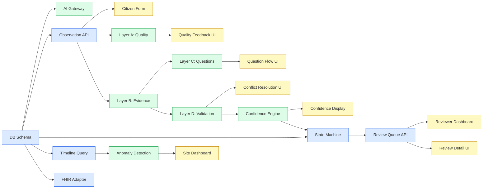

# AquaGuard AI — Team Task Split

> **OneAquaHealth IEEE Hackathon | Track 3: AI-Supported Assessment**
> 3-person team | Sep 28 – Oct 3, 2026 (6 working days)

---

## Section 1 — Team Overview

| Member | Title | Primary Responsibilities | Tech Focus |
|---|---|---|---|
| **Member A** | Full-Stack Lead / Backend Engineer | API design, database schema, state machine, auth, deployment, FHIR adapter, integration glue | Node.js / Fastify, PostgreSQL + PostGIS, Redis/BullMQ, Docker, Render, SQL |
| **Member B** | AI/ML Engineer | All 4 AI layers, AI Gateway, confidence engine, explainability, anomaly detection, safety policy, model evaluation | TypeScript AI SDK, Gemini Vision API, OpenAI API, Zod, statistics |
| **Member C** | Frontend Engineer / UX + Submission | All citizen + reviewer UI, PWA/offline, demo recording, README screenshots, Devpost submission | Next.js 14, Tailwind CSS, shadcn/ui, React, Service Worker, IndexedDB |

### Collaboration Rules

| Rule | Detail |
|---|---|
| **Git branching** | `main` (production), `develop` (integration), `feature/A-*`, `feature/B-*`, `feature/C-*` |
| **PRs** | Every feature merged via PR; 1 review from another member required |
| **Schema changes** | ALL three members must approve any change to `packages/shared/src/schemas/` |
| **Daily sync** | Async doc: each member posts "Done / Doing / Blocked" by 09:00 and 18:00 |
| **Blocker rule** | Blocked > 2 hours → raise immediately in team chat; don't wait for sync |
| **Integration checkpoints** | End of Day 2, Day 4, Day 5 (see Section 6) |

---

## Section 2 — Day-by-Day Sprint Plan

### Day 1 — September 28 · Foundation

| Time | Member A (Backend) | Member B (AI/ML) | Member C (Frontend) |
|---|---|---|---|
| 09:00–12:00 | Monorepo setup (npm workspaces, tsconfig paths, turbo) | Research AI providers: test Gemini Vision + GPT-4o API calls with sample stream photos | Next.js 14 project scaffold with App Router; Tailwind + shadcn/ui setup |
| 12:00–14:00 | Full DB schema SQL DDL (all 9 tables) + Prisma/Drizzle ORM setup | Define AI Gateway abstraction interface (TypeScript); test provider fallback | Route structure: `/observe`, `/review`, `/sites`, `/dashboard` |
| 14:00–17:00 | Docker-compose (postgres+postgis, redis, api, worker, web) with health checks | Set up `packages/ai-engine/` structure; stub all 4 AI layer classes | Design system tokens; citizen multi-step form skeleton (5 steps, no logic) |
| 17:00–19:00 | JWT auth scaffold (register/login, role middleware); seed script scaffold | Confirm shared JSON contracts with A and C (see Section 4) | Navigation + layout components; mobile-first breakpoints |
| **EOD Goal** | `docker-compose up` runs; migrations apply; JWT auth works | AI Gateway calls Gemini Vision successfully; contracts agreed | App shells load; routing works; form stepper renders |

---

### Day 2 — September 29 · Core Systems

| Time | Member A (Backend) | Member B (AI/ML) | Member C (Frontend) |
|---|---|---|---|
| 09:00–12:00 | Site CRUD API (`POST/GET/PATCH /sites`, bbox filter) | **Layer A:** Blur detection (Laplacian variance), brightness histogram | Step 1 (Site Select): map picker + search with recent sites list |
| 12:00–14:00 | Observation CRUD API with Zod validation; `local_id` handling | **Layer A:** Occlusion detection; stream relevance via vision model | Step 2 (Capture): image upload + camera component; GPS auto-capture |
| 14:00–17:00 | Media upload pipeline: presign → direct S3 → confirm → enqueue | **Layer A:** Duplicate detection (pHash + Hamming); quality score formula | Step 3 (Observations): structured form fields (water clarity, odour, flow) |
| 17:00–19:00 | Observation state machine class with transitions + audit logging | **Layer A:** `POST /media/:id/quality-check` response schema; connect to API | Quality feedback UI component (score badge, factor list, suggestions, retake) |
| **EOD Goal** | Full observation lifecycle works in Postman; media uploads to R2 | Layer A: quality score JSON returned for any uploaded image | Citizen can complete steps 1–3 and upload a photo |

> **Day 2 Integration Checkpoint** (19:00): A confirms API contracts match shared schema. C confirms form submits to A's API correctly. B confirms quality check endpoint is callable from the worker.

---

### Day 3 — September 30 · AI Intelligence

| Time | Member A (Backend) | Member B (AI/ML) | Member C (Frontend) |
|---|---|---|---|
| 09:00–12:00 | Human review queue API (`GET /review/queue` with filters + pagination) | **Layer B:** Evidence detection prompt engineering; test 10 indicator types | Step 4 (AI Guidance): quality score display; evidence indicator cards |
| 12:00–14:00 | Review actions API (`POST /assessments/:id/review`); state transitions | **Layer B:** Structured JSON extraction + Zod validation; store ai_evidence | Adaptive question flow UI: card-by-card conversational interface |
| 14:00–17:00 | Audit trail middleware: auto-log every API call to audit_logs | **Layer C:** Question bank (25 questions); selection engine from evidence | Conflict resolution UI: warning card + "keep / update / add note" |
| 17:00–19:00 | Historical baseline query (last 10 obs at site, mean + stddev) | **Layer D:** Rule engine (4+ deterministic rules); LLM conflict explanation | Confidence display component: score gauge + factor table + narrative |
| **EOD Goal** | Review queue returns data; audit trail writes; historical query runs | Layers B, C, D all return valid JSON for a test observation | Steps 4–5 of citizen form complete; conflict UI renders with mock data |

---

### Day 4 — October 1 · Review System + Site Intelligence

| Time | Member A (Backend) | Member B (AI/ML) | Member C (Frontend) |
|---|---|---|---|
| 09:00–12:00 | Site health timeline aggregate SQL query (weekly, per-indicator) | Confidence algorithm (5-factor weighted); confidence routing (VALID/REVIEW/HUMAN) | Reviewer dashboard (stats cards: pending, accepted, rejected, anomalies) |
| 12:00–14:00 | Anomaly detection function (z-score vs baseline); alert generation | Explainability template engine (WHAT/WHY/EVIDENCE/NEXT_ACTION) | Observation detail review UI (photos + citizen answers + AI evidence panels) |
| 14:00–17:00 | Alert API endpoints; FHIR R4 adapter (CanonicalObservation → FHIR JSON) | Wire up all 4 AI layers end-to-end in worker queue processor | Review action buttons (accept/correct/reject) + correction form |
| 17:00–19:00 | GET /export/fhir/:id endpoint; deployment config (Render + Vercel env vars) | AI safety policy middleware: pattern matching + forbidden output rejection | Site dashboard: timeline line chart + trend arrows + anomaly badges |
| **EOD Goal** | Timeline query works; anomaly fires on seeded data; FHIR endpoint returns valid R4 JSON | Full AI pipeline: upload photo → quality → evidence → questions → validation → confidence | Reviewer can open obs, see all panels, accept/correct; site dashboard renders |

> **Day 4 Integration Checkpoint** (19:00): Full AI pipeline tested by B with A's observation API. C's reviewer UI tested with real data from A's review queue endpoint.

---

### Day 5 — October 2 · Integration + Polish

| Time | Member A (Backend) | Member B (AI/ML) | Member C (Frontend) |
|---|---|---|---|
| 09:00–12:00 | Full integration test: run 12-step demo scenario manually end-to-end | Build evaluation dataset: 20 labelled test images (turbid/clear/debris/vegetation) | PWA manifest + service worker (cache-first app shell, network-first API) |
| 12:00–14:00 | Fix integration bugs; API error responses standardised | Run evaluation: precision/recall/F1 for Layer B; accuracy for Layer D | Offline observation creation (IndexedDB); syncStatus state machine |
| 14:00–17:00 | **Full team integration session** — all three together, live system walkthrough | Model versioning documented; evaluation metrics written up for submission | Background sync on network restore; resumable upload chunking |
| 17:00–19:00 | Seed database: 3 sites, 20 obs at different states, 5 reviewer decisions | Citizen observation status tracker page (/my-observations) | All error states + loading states + empty states throughout UI |
| **EOD Goal** | Full 12-step demo scenario runs end-to-end without errors on live deployment | AI evaluation metrics calculated; model methodology documented | PWA installable; offline observation queues and syncs |

> **Day 5 Integration Checkpoint** (15:00): Full team live walkthrough of 12-step scenario. All blockers resolved before 17:00.

---

### Day 6 — October 3 · Demo + Submission

| Time | Member A (Backend) | Member B (AI/ML) | Member C (Frontend/Submission) |
|---|---|---|---|
| 09:00–11:00 | Final bug fixes from overnight testing; API documentation (OpenAPI spec) | Record AI demonstration clips (quality check, evidence detection, conflict) | Record 3–5 min demo video following 12-step scenario exactly |
| 11:00–13:00 | Verify deployment stable; check all env vars set correctly | Write AI methodology section for Devpost (explainability, safety, evaluation) | Edit demo video; upload to YouTube (unlisted) |
| 13:00–15:00 | Final README review; architecture diagram PNG export | Verify all AI outputs include provenance (model, version, prompt, hash) | Devpost form: title, description, track, team, links, video URL |
| 15:00–17:00 | Confirm GitHub repo is public; all commits clean; .env.example complete | Review Devpost submission for technical accuracy | Final checklist (Section 8) — all three members verify together |
| **EOD Goal** | GitHub public; README complete; API docs published | AI methodology documented; evaluation metrics in submission | Devpost submitted by 17:00 (buffer before Oct 4 deadline) |

---

## Section 3 — Full Feature Ownership Table

| Feature | Owner | Reviewer | Priority | Est. Hours | Day |
|---|---|---|---|---|---|
| Monorepo setup (npm workspaces, turbo, tsconfig) | **A** | C | P0 | 2h | 1 |
| PostgreSQL schema + migrations (all 9 tables) | **A** | B | P0 | 3h | 1 |
| Docker-compose configuration | **A** | C | P0 | 1h | 1 |
| JWT auth + role middleware (citizen/reviewer/admin) | **A** | B | P0 | 2h | 1 |
| Site CRUD API | **A** | C | P0 | 2h | 2 |
| Observation CRUD API + Zod validation | **A** | B | P0 | 3h | 2 |
| Media upload pipeline (compress + SHA256 + presign + confirm + queue) | **A** | B | P0 | 3h | 2 |
| Observation state machine + transition logging | **A** | B | P0 | 2h | 2 |
| Human review queue API (filters + pagination) | **A** | C | P0 | 2h | 3 |
| Review actions API (accept/correct/reject/resubmit) | **A** | B | P0 | 2h | 3 |
| Audit trail middleware (auto-log all AI + human actions) | **A** | B | P0 | 2h | 3 |
| Historical baseline query (mean + stddev per site) | **A** | B | P0 | 1h | 3 |
| Site health timeline SQL query (weekly aggregate) | **A** | B | P1 | 2h | 4 |
| Anomaly detection (z-score function + alert generation) | **A** | B | P1 | 2h | 4 |
| Alert engine (type tagging + API endpoint) | **A** | B | P1 | 1h | 4 |
| FHIR R4 adapter (CanonicalObservation → FHIR Observation) | **A** | B | P1 | 2h | 4 |
| Production deployment (Render + Vercel + Supabase + R2 + Upstash) | **A** | C | P0 | 2h | 5 |
| Database seed data (3 sites, 20 obs, 5 reviews) | **A** | C | P0 | 1h | 5 |
| OpenAPI / Swagger documentation | **A** | B | P1 | 1h | 6 |
| **AI Gateway abstraction (provider adapter pattern)** | **B** | A | P0 | 3h | 1 |
| **Layer A: Image Quality Engine** (blur + brightness + occlusion + relevance + duplicate + score) | **B** | A | P0 | 5h | 2 |
| **Layer B: Ecological Evidence Detection** (10 indicators, structured JSON, Zod validation) | **B** | A | P0 | 6h | 3 |
| **Layer C: Adaptive Follow-up Questions** (question bank 25q + selection engine) | **B** | A | P0 | 4h | 3 |
| **Layer D: Cross-Validation Engine** (rule engine + LLM conflict explanation) | **B** | A | P0 | 5h | 3 |
| Confidence calculation algorithm (5-factor weighted score) | **B** | A | P0 | 3h | 4 |
| Explainability template engine (WHAT/WHY/EVIDENCE/NEXT_ACTION) | **B** | A | P0 | 2h | 4 |
| Wire all AI layers end-to-end in worker queue processor | **B** | A | P0 | 3h | 4 |
| AI safety policy enforcement (gateway middleware) | **B** | A | P0 | 2h | 5 |
| Model versioning (prompt_version, model_version tracking) | **B** | A | P1 | 1h | 5 |
| AI evaluation dataset (20 labelled images) + metrics (precision/recall/F1) | **B** | A | P1 | 3h | 5 |
| **Citizen multi-step form** (5 steps: site → capture → observations → AI guidance → submit) | **C** | A | P0 | 6h | 2 |
| Image capture + quality feedback UI (score badge + suggestions + retake) | **C** | B | P0 | 3h | 2 |
| Adaptive question flow UI (conversational card-by-card) | **C** | B | P0 | 3h | 3 |
| Conflict resolution UI (warning card + resolve options) | **C** | B | P0 | 2h | 3 |
| Confidence display component (gauge + factor table + narrative + routing badge) | **C** | B | P0 | 3h | 3 |
| Reviewer dashboard (stats cards + review queue table) | **C** | A | P0 | 3h | 4 |
| Observation detail review UI (photos + citizen + AI + history side-by-side) | **C** | A | P0 | 4h | 4 |
| Review action buttons + correction form | **C** | A | P0 | 2h | 4 |
| Site dashboard + timeline chart + trend arrows + anomaly badges | **C** | B | P1 | 3h | 4 |
| Citizen observation status tracker (`/my-observations`) | **C** | A | P1 | 2h | 5 |
| PWA manifest + service worker | **C** | A | P1 | 2h | 5 |
| Offline observation queue (IndexedDB + syncStatus) | **C** | A | P1 | 3h | 5 |
| Background sync on network restore | **C** | A | P1 | 1h | 5 |
| Error states + loading states + empty states (all screens) | **C** | A | P0 | 2h | 5 |
| Demo video (3–5 min, 12-step scenario) | **C** | A+B | P0 | 3h | 6 |
| README screenshots (citizen form, reviewer dashboard, site dashboard) | **C** | A | P0 | 1h | 6 |
| Devpost submission form completion | **C** | A+B | P0 | 2h | 6 |

---

## Section 4 — Shared Interfaces & Contracts

> [!IMPORTANT]
> These contracts must be agreed and merged to `packages/shared/` by **Day 1 EOD**. No member starts implementation until contracts are locked.

### Observation

```json
{
  "id": "3fa85f64-5717-4562-b3fc-2c963f66afa6",
  "localId": "local-1727506800000",
  "siteId": "8d1a2e4f-0c3b-4a7d-9e2f-1b5c6d8e9f0a",
  "observerId": "7c2b1a3d-4e5f-6a7b-8c9d-0e1f2a3b4c5d",
  "status": "SUBMITTED",
  "syncStatus": "SYNCED",
  "gps": { "lat": -37.8136, "lng": 144.9631, "accuracy": 5 },
  "observedAt": "2026-09-28T08:00:00Z",
  "envObservations": {
    "waterClarity": "slightly_cloudy",
    "odour": "none",
    "debris": "none",
    "flowRate": "moderate",
    "channelType": "natural"
  },
  "qualityScore": 78,
  "version": 1,
  "createdAt": "2026-09-28T08:05:00Z",
  "updatedAt": "2026-09-28T08:05:00Z"
}
```

### AIResult

```json
{
  "id": "a1b2c3d4-e5f6-7890-abcd-ef1234567890",
  "observationId": "3fa85f64-5717-4562-b3fc-2c963f66afa6",
  "model": "gemini-1.5-pro-vision",
  "modelVersion": "001",
  "promptVersion": "evidence-v2.1",
  "inputHash": "sha256:abc123def456",
  "confidence": 74,
  "confidenceFactors": {
    "imageQuality": 88,
    "aiEvidenceAgreement": 72,
    "citizenConsistency": 65,
    "gpsValidity": 100,
    "historicalConsistency": 58
  },
  "explanation": {
    "what": "Possible turbidity detected",
    "why": "Reduced streambed visibility and elevated brown pixel distribution suggest water turbidity",
    "evidence": ["Photo #2 — turbidity detected at 87% confidence (region: centre-left)"],
    "confidence": 74,
    "nextAction": "Reviewer recommended due to historical inconsistency"
  },
  "validationWarnings": [],
  "routingDecision": "REVIEW_REQUIRED",
  "createdAt": "2026-09-28T08:06:00Z"
}
```

### AIEvidence

```json
{
  "id": "e1f2a3b4-c5d6-7890-ef12-34567890abcd",
  "aiResultId": "a1b2c3d4-e5f6-7890-abcd-ef1234567890",
  "indicator": "turbidity",
  "present": true,
  "confidence": 0.87,
  "reasoning": "Water appears visibly cloudy with reduced streambed visibility",
  "sourceMediaId": "m1a2b3c4-d5e6-7890-f123-456789012345",
  "imageRegion": { "x": 0.1, "y": 0.3, "w": 0.6, "h": 0.4 },
  "model": "gemini-1.5-pro-vision",
  "modelVersion": "001",
  "createdAt": "2026-09-28T08:06:00Z"
}
```

### ValidationWarning

```json
{
  "id": "w1a2b3c4-d5e6-7890-f123-456789012345",
  "type": "CITIZEN_AI_CONFLICT",
  "severity": "HIGH",
  "citizenAnswer": "clear",
  "aiDetection": "turbidity",
  "confidence": 0.87,
  "explanation": {
    "what": "Your water clarity answer may not match the image",
    "why": "The analysis detected reduced water clarity with 87% confidence while you selected 'clear'",
    "nextAction": "Please review and update your water clarity response"
  },
  "resolved": false
}
```

### HumanReview

```json
{
  "id": "r1a2b3c4-d5e6-7890-f123-456789012345",
  "observationId": "3fa85f64-5717-4562-b3fc-2c963f66afa6",
  "reviewerId": "rev-uuid-here",
  "decision": "CORRECTED",
  "citizenObservation": { "waterClarity": "clear", "debris": "none" },
  "aiAssessment": { "turbidity": 0.87, "floating_debris": 0.72 },
  "humanAssessment": { "waterClarity": "slightly_turbid", "debris": "present" },
  "finalAssessment": { "waterClarity": "slightly_turbid", "debris": "present" },
  "reason": "Image clearly shows turbidity. Citizen observation corrected after photo review.",
  "createdAt": "2026-09-28T10:00:00Z"
}
```

### MediaUploadResponse

```json
{
  "mediaId": "m1a2b3c4-d5e6-7890-f123-456789012345",
  "presignedUrl": "https://r2.cloudflare.com/bucket/...",
  "expiresAt": "2026-09-28T08:35:00Z",
  "duplicate": false,
  "existingMediaId": null
}
```

---

## Section 5 — Git Workflow

### Branch Naming

```
main                          ← production (deploy from here)
develop                       ← integration branch (all PRs merge here)
feature/A-observation-api     ← Member A working on observation API
feature/A-state-machine       ← Member A working on state machine
feature/B-image-quality       ← Member B working on Layer A
feature/B-evidence-detection  ← Member B working on Layer B
feature/C-citizen-form        ← Member C working on citizen form
feature/C-reviewer-dashboard  ← Member C working on reviewer dashboard
```

### PR Template

```markdown
## What does this PR do?
[Brief description]

## Checklist
- [ ] TypeScript types in `packages/shared/` updated if needed
- [ ] Zod schemas validated
- [ ] DB migration added (if schema changed)
- [ ] Error handling included
- [ ] Tested locally against docker-compose
- [ ] No .env secrets committed

## Breaking changes?
[ ] Yes — describe: ...
[ ] No
```

### Merge Rules

| Target | Method | Who |
|---|---|---|
| `develop` | Squash merge | Any member after 1 approval |
| `main` | Fast-forward merge from develop | Member A only |

### Schema Conflict Resolution

If two members need to change `packages/shared/src/schemas/` simultaneously:
1. Create a GitHub issue titled `SCHEMA CONFLICT: [description]`
2. All 3 members join a 15-minute call
3. Agree on the unified schema
4. One member (A) pushes the resolution; others rebase

---

## Section 6 — Communication & Sync Points

### Async Standup Format (twice daily, 09:00 + 18:00)

```
✅ Done:    [bullet list]
🔨 Doing:   [bullet list]
🚧 Blocked: [description or NONE]
📦 Needs from team: [request or NONE]
```

### Integration Checkpoints

| Checkpoint | Time | What to verify |
|---|---|---|
| **Day 2 EOD** | Sep 29, 19:00 | API contracts live on `develop`; C's form POSTs to A's `/observations`; B's quality check callable from worker |
| **Day 4 EOD** | Oct 1, 19:00 | Full AI pipeline end-to-end (upload → quality → evidence → questions → validate → confidence); C's reviewer UI loads real review queue data |
| **Day 5 Full-Team Session** | Oct 2, 15:00 | All three members together; run 12-step demo scenario live; log any remaining bugs; agree on final scope |
| **Day 6 Submission** | Oct 3, 17:00 | Devpost submitted; GitHub public; video uploaded |

### Blocker Escalation

> **Rule:** Blocked > 2 hours → post immediately in team chat with:
> - What you're trying to do
> - What you've tried
> - What you need from whom
> Don't silently work around a blocker — it creates integration debt.

---

## Section 7 — Dependency Graph



**Legend:** 🔵 Member A · 🟢 Member B · 🟡 Member C

**Critical paths:**
- `DB Schema → Observation API → Citizen Form` (A blocks C on Day 1)
- `AI Gateway → Layer A → Quality Feedback UI` (B blocks C on Day 2)
- `Layer B → Layer D → Confidence Engine → Confidence Display` (B internal, then B→C on Day 3)
- `Review Queue API → Reviewer Dashboard` (A blocks C on Day 3–4)

---

## Section 8 — Devpost Submission Checklist

| Item | Owner | Status |
|---|---|---|
| **Project Setup** | | |
| Project title: "AquaGuard AI — Trusted Citizen Stream Assessment" | C | ☐ |
| Tagline: "AI improves the reliability of citizen-generated environmental evidence" | C | ☐ |
| Track selection: Track 3 — AI-Supported Assessment | C | ☐ |
| Team member profiles linked | C | ☐ |
| **Description Sections** | | |
| Problem statement (2-3 paragraphs) | C | ☐ |
| Track 3 alignment statement (reference official challenge criteria) | B | ☐ |
| Solution description (pipeline: Citizen → Ecosystem Insight) | C | ☐ |
| AI methodology: 4 layers explained, prompts, safety policy | B | ☐ |
| Explainability and human-in-the-loop description | B | ☐ |
| Impact statement (citizen science quality, scalability, One Health relevance) | C | ☐ |
| Limitations clearly stated | B | ☐ |
| Future roadmap (V2 pilot, V3 production) | C | ☐ |
| **Technical Evidence** | | |
| Architecture diagram (PNG embedded) | A | ☐ |
| Tech stack list | A | ☐ |
| AI evaluation metrics (precision/recall/F1 for Layer B) | B | ☐ |
| FHIR interoperability note | A | ☐ |
| **Links** | | |
| Public GitHub repository URL | A | ☐ |
| README with setup instructions verified working | A | ☐ |
| Live demo URL (Render/Vercel deployment) | A | ☐ |
| Demo video URL (YouTube unlisted, 3–5 min) | C | ☐ |
| **Final Checks** | | |
| Demo video plays without error | C | ☐ |
| Live demo URL loads and is accessible | A | ☐ |
| GitHub repo is public (not private) | A | ☐ |
| All team members added to Devpost project | C | ☐ |
| Submission form saved and submitted (not just draft) | C | ☐ |
| Submitted before October 4, 2026 at 9:00 PM PDT | C | ☐ |

---

## Quick Reference — Hour Budget

| Member | Total Est. Hours | P0 Hours | P1 Hours |
|---|---|---|---|
| **A** (Backend) | ~32h | 24h | 8h |
| **B** (AI/ML) | ~33h | 26h | 7h |
| **C** (Frontend/Submission) | ~38h | 28h | 10h |
| **Total** | **~103h** | **78h** | **25h** |

> At 6 working days × ~6 productive hours/day = **36h per person**. All P0 features fit within budget. P1 features should be attempted but can be documented as roadmap if time runs out.
